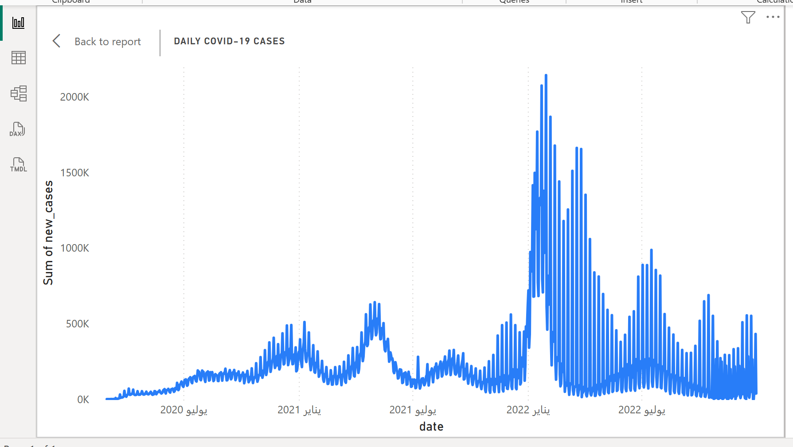
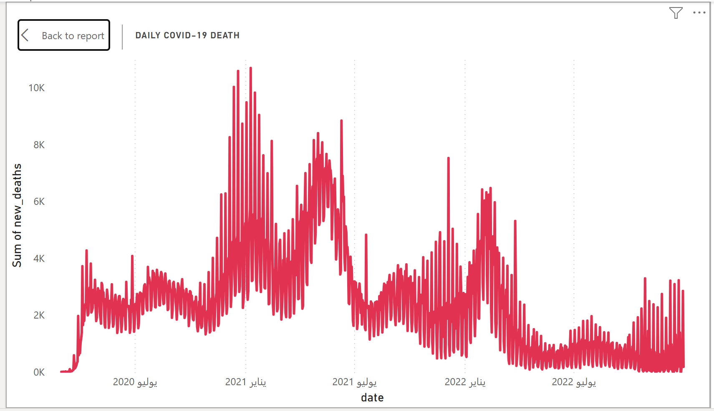

 <em>Interactive COVID-19 Dashboard Built with Power BI.</em> 

# COVID-19 Global Trends Dashboard

## Overview
This project presents an interactive **Power BI dashboard** that analyzes the evolution of the COVID-19 pandemic across selected countries.  
The dashboard focuses on **daily cases, daily deaths, and vaccination progress**, providing both high-level insights and detailed time-based analysis.

---

## Data Source
- **Provider:** Our World in Data (OWID)
- **Dataset:** COVID-19 Compact Dataset
- **Coverage:** Global, country-level, daily data
- **Format:** CSV

The original dataset was reduced and cleaned to ensure efficient processing and accurate visualization.

---

## Tools & Technologies
- **Programming Language:** R  
- **Data Preparation:** R (readr, dplyr, lubridate)  
- **Visualization:** Power BI Desktop  
- **Version Control:** GitHub  

---

## Data Preparation
The data preparation process included two main stages:

1. **Data Reduction**
   - Selected only essential variables (cases, deaths, vaccination, population).
   - Limited the analysis to selected countries and a relevant time period.
   - Reduced the dataset size to improve performance.

2. **Data Cleaning**
   - Converted date fields to proper date formats.
   - Handled missing and invalid values (e.g., negative corrections).
   - Prepared a final, lightweight dataset optimized for Power BI.

---

## Dashboard Features
- **KPIs** showing total cases, total deaths, and latest vaccination numbers.
- **Time-series charts** for daily cases and daily deaths.
- **Vaccination trend analysis** using cumulative data.
- **Country comparison visuals** for fair cross-country analysis.
- **Interactive country slicer** implemented as a **drop-down** to improve usability and reduce visual clutter.
- **Date range filtering** for focused temporal analysis.

---

## How to use
Open the Power BI file and use the country and date slicers to explore COVID-19 trends, comparisons, and vaccinated progress interactvely.

---

## Dashboard visuals

### Daily COVID-19 Cases Trend
This chart shows the daily evolution of confirmed COVID-19 cases, highlighting major pandemic waves across selected countries.

### Daily COVID-19 Deaths Trend
This visualization illustrates daily COVID-19 deaths, which generally follow case trends with a noticeable time lag.

### Vaccination Progress Over Time
This chart presents the cumulative number of fully vaccinated individuals, demonstrating the rollout and scale of vaccination programs.

)

### Country Comparison
This comparison highlights differences in COVID-19 case volumes across selected countries, enabling cross-country analysis.

---

## Key Insights

- COVID-19 cases showed a clear and rapid increase at the beginning of the pandemic, with infection levels peaking across most selected countries in **early 2022**, reflecting the impact of major pandemic waves during that period.

- Death trends generally followed case trends with a **noticeable time lag**, indicating that severe outcomes tended to occur after infection peaks rather than simultaneously.

- The rollout of vaccination programs coincided with a **stabilization and reduction in death severity**, even during periods when case numbers remained relatively high.

- Countries with **higher vaccination coverage** experienced **lower relative death rates** compared to their case volumes, highlighting the role of vaccination in reducing severe outcomes.

- Data revisions and reporting inconsistencies resulted in missing or corrected daily values. These were handled carefully during data preparation to avoid misleading interpretations and ensure analytical integrity.

---

## Recommendations

Based on the analysis and observed trends, the following recommendations are proposed:

- Strengthen early intervention measures during rising case trends to reduce delayed severe outcomes, as death peaks were observed to lag behind infection peaks.

- Maintain and expand vaccination coverage, as higher vaccination levels were associated with reduced death severity even during periods of high case numbers.

- Improve data consistency and transparency in daily reporting to minimize the impact of data revisions and missing values on analysis and decision-making.

---

## Limitations
- COVID-19 reporting standards vary across countries, which may affect data completeness and comparability.
- Some daily values were revised or corrected by official sources, leading to missing observations.
- The analysis focuses on selected countries and does not represent a full global comparison.

---

## Conclusion
This project demonstrates an end-to-end workflow for **data reduction, cleaning, and visualization**, transforming complex real-world data into an interactive and interpretable dashboard.  
The results emphasize the importance of temporal analysis, fair population-based comparisons, and cautious interpretation of public health data.

---

## Contact & Feedback

- **Author:** Mohammed Elmojtaba

- **GitHub:** 
https://github.com/M-elmojtaba-code

- **E-Mail:** mohammed.elmojtaba@hotmail.com

- **Linkedin:** 
https://linkedin.com/in/mohamedelmojtaba

I highly appreciate any **feedback, comments, or reviews** on this project.  
I am continuously learning and always open to improving my skills through constructive feedback and collaboration.

Feel free to reach out or share suggestions — your input is always welcome.
